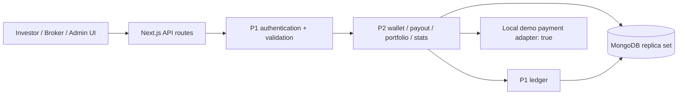

# Fractional Real Estate Investment Portal

Academic fractional-property investment portal using Next.js App Router, TypeScript, MongoDB/Mongoose, Zod, JWT authentication, and a ledger-backed demo wallet. All amounts are integer paise.

## Implementation status

The shared P1 foundation and team frontend are integrated. P2 provides ledger-backed demo payments, payouts, portfolio reporting, and admin/broker APIs. The latest integration pass corrects broker serialization, stored-order validation, preview side effects, purchase-date returns, and financial request validation.

- [x] Integer payout calculator, preview, transactional sale, investor payouts, and platform fee credit.
- [x] Demo top-up orders and verification, replay protection, wallet reads, and withdrawal approvals.
- [x] Portfolio holdings, estimates, summary, and transaction history.
- [x] Admin statistics, users, settings, KYC, and withdrawals.
- [x] Broker listing statistics, ownership-checked funding timeline, and notifications.
- [x] Demo seed script with eight listings, nine accounts, ledger reconciliation, and sample sale.
- [x] Unit/route regressions and real replica-set acceptance tests.
- [x] Integration with actual P1 implementation and full application build.
- [x] P2 database acceptance tests against the actual P1 foundation (16 passing checks).
- [x] Investor, broker, and admin frontend workspaces; explicit role selection at sign-in.
- [x] Accessible login feedback, safe workspace redirects, subtle motion, and bounded scrolling.
- [ ] Deployment and end-to-end verification in the deployed environment.

## Team ownership

| Role | Scope | Contributor |
|---|---|---|
| P1 | Models, auth, handler, ledger, property lifecycle, investment engine | Archit Jain |
| P2 | Payouts, demo wallet, portfolio, admin/broker data, seed, docs | Aryan Gupta |
| P3 | Shared frontend kit, public marketplace, investor UI | Team |
| P4 | Admin UI | Anuj Sharma |
| P5 | Auth and broker UI | Arush Saxena |

Live application: pending deployment. Demo video: pending recording.

## Architecture

Each API route declares its permitted roles and request schema through P1's shared `route()` wrapper. P2 services read the shared Mongoose models and pass the same Mongo session to every ledger and notification operation belonging to a financial transaction. The ledger is the only component that changes wallet balances.



## Local setup

Requires Node.js 20+ and MongoDB Atlas or a local replica set. Standalone MongoDB does not support the required multi-document transactions.

```powershell
npm ci
Copy-Item .env.example .env
# Set MONGODB_URI, JWT_SECRET, and MOCK_GATEWAY_SECRET in .env.
# Use a dedicated demo database: the seed command clears its application collections.
npm run seed -- --reset-demo
npm run dev
```

The seed resets only the application's nine model collections, initializes indexes, funds wallets through the ledger, inserts investments, pays broker commissions for fully funded properties, and executes a sample sale. Re-running it recreates the same demo dataset. The explicit `--reset-demo` flag prevents an accidental reset.

## Demo payments

`demoRazorpayRequest()` always resolves to `true`. It performs no external requests and ignores any real provider credentials. A top-up is credited only after a valid, owned demo order and its generated HMAC are verified. The PAID marker and wallet credit commit together; replay returns `409 DUPLICATE_PAYMENT`.

1. Call `POST /api/v1/wallet/topup/order` with `{ "amount": 10000 }` (₹100).
2. Copy `orderId`, `mockPayment.paymentId`, and `mockPayment.signature` from its response.
3. Send those fields to `POST /api/v1/wallet/topup/verify`.
4. The response contains `{ "balance": 10000, "mock": true, "paymentSuccess": true }` for an initially empty wallet, inside the standard success envelope.

Withdrawals also simulate bank settlement. Approval debits the demo wallet, while rejection does not move money.

## Seed credentials

| Email | Password | Role / state |
|---|---|---|
| admin@demo.com | Admin@123 | Admin |
| rohit@demo.com | Broker@123 | Approved broker |
| newbroker@demo.com | Broker@123 | Unapproved broker |
| aman@demo.com | Investor@123 | Investor, approved KYC |
| priya@demo.com | Investor@123 | Investor, approved KYC |
| karan@demo.com | Investor@123 | Investor, approved KYC |
| neha@demo.com | Investor@123 | Investor, pending KYC review |
| vikram@demo.com | Investor@123 | Investor, approved KYC |
| fresh@demo.com | Investor@123 | Empty wallet, no KYC submitted |

## Documentation and checks

- [API reference](docs/API.md)
- [P1 integration requirements](docs/P1_INTEGRATION.md)
- [P2 file inventory and implementation status](docs/P2_IMPLEMENTATION.md)
- [Testing instructions and limitations](docs/testing/README.md)

Run `npm test`, `node node_modules/typescript/bin/tsc --noEmit --incremental false`, and `npm run build`. The unit/route suite has 83 passing checks. Run the separate real database configuration for the 16 transaction acceptance checks; setup and the disposable-database restriction are documented in the testing guide.

Portfolio appreciation is calculated separately for each purchase, starting at the later of its purchase date and the property funding date, and capped at the property's holding period. It is an illustrative estimate. Refunded holdings are excluded from both invested principal and current value in summary ROI. Sold holdings use actual recorded payout amounts. Daily statistics use UTC calendar days. Pending withdrawal requests do not reserve funds; approval rechecks available balance.

This is an academic project. No real money or securities are involved.

## Sign-in and navigation

Choose **Investor**, **Broker**, or **Admin** before signing in. The selected role must match the account stored in the database; it never grants permissions. Demo credential buttons fill both the credentials and the matching role. Existing API clients may omit the optional role field.

After sign-in, safe internal destinations are retained, while external URLs and another role's workspace fall back to the account's home. Keyboard users can use native role radios, associated field labels, inline errors, and the skip link. Menus and notification lists scroll within the viewport. Subtle entrance and control transitions respect reduced-motion preferences.

## Contributing without conflicts

Keep feature branches aligned with the current remote before starting work, and stage only files assigned to the feature. P2 backend corrections stay within its services, validators, and routes. The explicit sign-in and scrolling request additionally touches shared auth and layout files; coordinate those files with P3/P5 before merging. The architecture diagram above is unchanged.

GitHub attributes commits through the commit author email. If a contribution is missing, check `git log --format="%h %an <%ae>"` and verify that email on your GitHub account before making further commits. Adding an old email can associate historical commits without rewriting team history. See [GitHub contribution troubleshooting](https://docs.github.com/en/account-and-profile/how-tos/contribution-settings/troubleshooting-missing-contributions).
