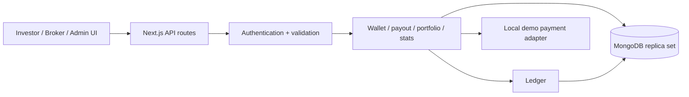

<p align="center">
  
</p>

<h1 align="center">EstatePortal</h1>

<p align="center">Fractional Real Estate Investment Platform</p>

<p align="center">
  
  
  
  
  
  
</p>

<p align="center">
  <a href="https://estate.0xarchit.is-a.dev/"><strong>Live demo</strong></a>
</p>

EstatePortal is an academic demo of a fractional property-investment portal. Investors buy integer unit shares of listed properties, brokers list and track funding, and admins run due diligence and settlements. Every balance change flows through an auditable, ledger-backed demo wallet. All amounts are stored as integer paise.

> Academic project. No real money or securities are involved.

## Features

### Investor
- Browse the marketplace and open a property with live funding progress.
- Buy fractional units and top up a demo wallet.
- Track holdings, estimated appreciation, summary ROI, and full transaction history.
- Request withdrawals against a simulated bank settlement.

### Broker
- List properties and follow an ownership-checked funding timeline.
- Earn commission when a listing is fully funded.
- Read listing statistics and notifications.

### Admin
- View platform statistics and manage users.
- Review KYC submissions and approve or reject withdrawals.
- Adjust platform settings.

### Platform
- The ledger is the only component that moves wallet balances, and every financial transaction shares one Mongo session.
- Oversell is blocked by a conditional unit update; payments are idempotent and replays return `409 DUPLICATE_PAYMENT`.
- Sales and payouts use BigInt math with a conservation check, plus a platform fee credit.
- Each API route declares its roles and request schema through a shared `route()` wrapper backed by JWT auth and Zod validation.

## Tech stack

Next.js 16 (App Router), React 19, TypeScript 6, MongoDB with Mongoose 8, Zod, JWT, Tailwind CSS 3, TanStack Query, Recharts, and Framer Motion.

## Architecture



Services read shared Mongoose models and pass the same session to every ledger and notification write inside a transaction. The demo payment adapter performs no external calls.

## Quick start

Requires Node.js 20+ and MongoDB Atlas or a local replica set. Standalone MongoDB does not support the multi-document transactions this project relies on.

```bash
npm ci
cp .env.example .env   # PowerShell: Copy-Item .env.example .env
# Set MONGODB_URI, JWT_SECRET, and MOCK_GATEWAY_SECRET in .env
npm run seed -- --reset-demo
npm run dev
```

The seed resets only the application collections, builds indexes, funds wallets through the ledger, inserts investments, pays broker commissions on fully funded properties, and runs a sample sale. The explicit `--reset-demo` flag guards against an accidental reset.

## Demo accounts

| Email | Password | Role / state |
|---|---|---|
| admin@demo.com | Admin@123 | Admin |
| rohit@demo.com | Broker@123 | Approved broker |
| newbroker@demo.com | Broker@123 | Unapproved broker |
| aman@demo.com | Investor@123 | Investor, approved KYC |
| priya@demo.com | Investor@123 | Investor, approved KYC |
| karan@demo.com | Investor@123 | Investor, approved KYC |
| neha@demo.com | Investor@123 | Investor, pending KYC review |
| vikram@demo.com | Investor@123 | Investor, approved KYC |
| fresh@demo.com | Investor@123 | Empty wallet, no KYC submitted |

Choose Investor, Broker, or Admin at sign-in. The selected role must match the stored account; it never grants permissions.

## Demo payments

`demoRazorpayRequest()` always resolves to `true`, makes no external request, and ignores real provider credentials. A top-up is credited only after a valid, owned demo order and its generated HMAC are verified.

1. `POST /api/v1/wallet/topup/order` with `{ "amount": 10000 }` (Rs 100).
2. Copy `orderId`, `mockPayment.paymentId`, and `mockPayment.signature` from the response.
3. Send those fields to `POST /api/v1/wallet/topup/verify`.
4. For an initially empty wallet the response contains `{ "balance": 10000, "mock": true, "paymentSuccess": true }`.

Withdrawals simulate bank settlement: approval debits the demo wallet, rejection does not move money.

## Scripts

| Command | Purpose |
|---|---|
| `npm run dev` | Start the development server |
| `npm run build` | Production build |
| `npm start` | Serve the production build |
| `npm run lint` | Lint the project |
| `npm run seed -- --reset-demo` | Reset and seed the demo dataset |
| `npm test` | Run the unit and route suite |
| `npm run concurrency` | Run the concurrency check against a replica set |

## Testing

The unit and route suite has 83 passing checks via `npm test`. A separate real-database configuration covers 16 transaction acceptance checks against an actual replica set; setup and the disposable-database restriction are documented in the testing guide. Also run `node node_modules/typescript/bin/tsc --noEmit --incremental false` and `npm run build`.

## How returns are calculated

Appreciation is computed per purchase, starting at the later of the purchase date and the property funding date, and capped at the holding period. It is an illustrative estimate. Refunded holdings are excluded from invested principal and current value in summary ROI; sold holdings use actual recorded payout amounts. Daily statistics use UTC calendar days. Pending withdrawals do not reserve funds; approval rechecks the available balance.

## Documentation

- [API reference](docs/API.md)
- [Testing guide](docs/testing/README.md)
- [P1 integration requirements](docs/P1_INTEGRATION.md)
- [P2 implementation notes](docs/P2_IMPLEMENTATION.md)

## Contributing

See [CONTRIBUTING](.github/CONTRIBUTING.md) and the [code of conduct](.github/CODE_OF_CONDUCT.md). Report vulnerabilities privately through the [security policy](.github/SECURITY.md).

## License

Released under the [MIT License](LICENSE).
