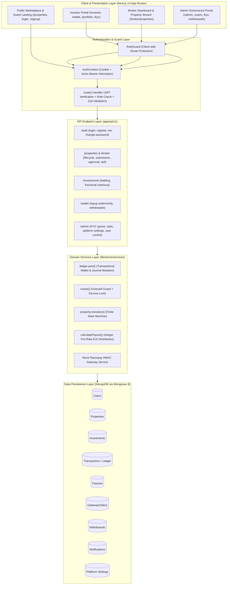
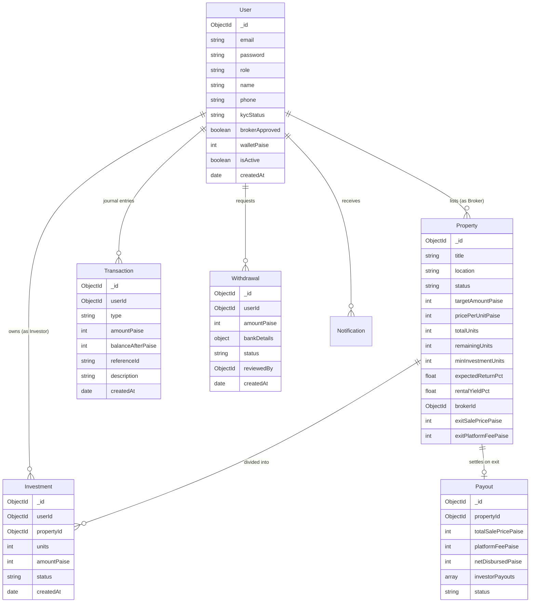
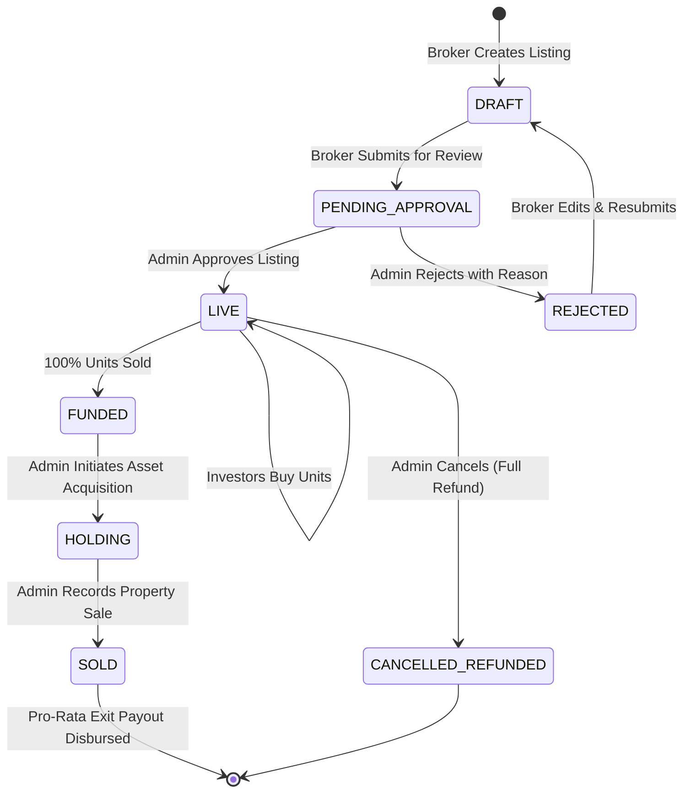
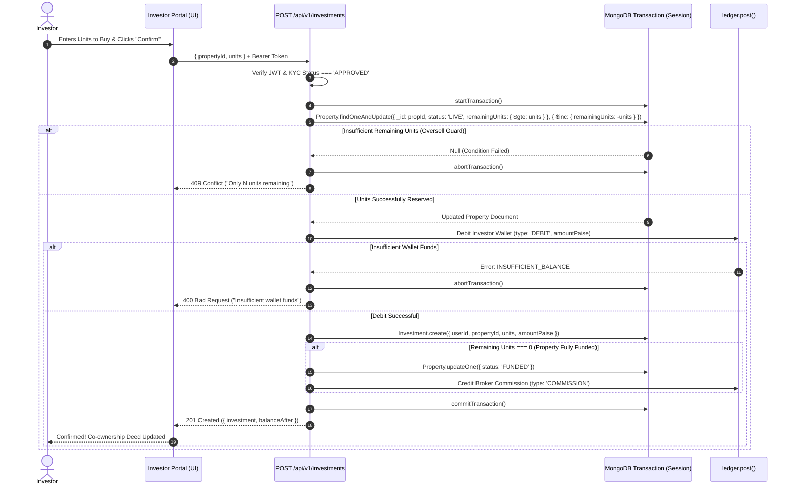
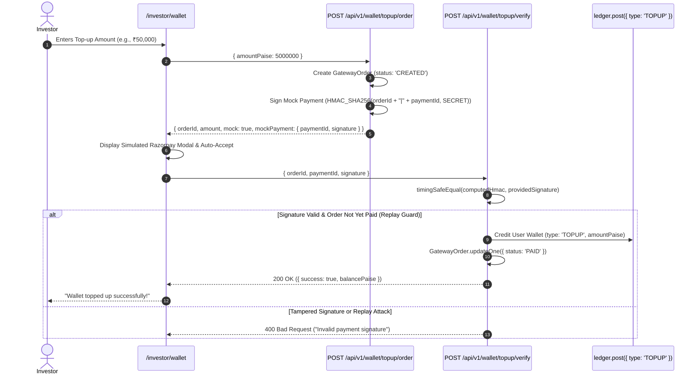

# Fractional Real Estate Investment Portal (EstatePortal)
### Complete Architecture, System Design & Technical Specification

---

## 1. Problem Statement (PS)

Real estate in India has traditionally suffered from high capital entry barriers (crores of rupees), illiquidity, opaque paperwork, and predatory brokerage models. 

**EstatePortal (W3Grads PS1)** is a full-stack, institutional-grade fractional real estate investment and secondary trading platform. It democratizes premium real estate by fractioning vetted commercial and residential properties into affordable, discrete investment units. 

### Key Business & Technical Goals:
1. **Fractional Ownership**: Properties are divided into discrete units (e.g., 1,000 units at ₹5,000 each = ₹50 Lakh target).
2. **Strict Financial Integrity**: All monetary values are represented and computed exclusively in **integer paise** (1 INR = 100 paise). Zero floating-point drift or rounding errors.
3. **Atomic Ledger**: User wallets mutate strictly through an append-only double-entry transactional ledger backed by MongoDB sessions.
4. **Strict Concurrency Protection**: High-demand property drops utilize atomic conditional database queries (`$gte`) to prevent overselling beyond 100% capacity under race conditions.
5. **Multi-Role Governance**: Tailored portal experiences for **Investors**, **Brokers**, and **Platform Admins** with strict role-based access control (RBAC).
6. **Zero External Billing Dependencies**: Self-contained, cryptographic mock payment gateway that simulates Razorpay orders and webhook HMAC verifications offline.

---

## 2. High-Level System Architecture

The application is structured as a unified **Next.js 14 App Router full-stack monolith**, enforcing clean separation between Client Components, Server-Side Route Handlers, Mongoose Data Layer, and Ledger Services.



---

## 3. Technology Stack & Implementation Details

| Layer / Concern | Technology | Purpose & How It Is Used |
|---|---|---|
| **Framework** | Next.js (App Router) | Unified SSR, static site generation, client-side routing, and API route handlers (`app/api/v1`). |
| **Language** | TypeScript 5 (Strict Mode) | Full-stack end-to-end type safety across API inputs, database schemas, and UI components. |
| **Database** | MongoDB + Mongoose 8 | Document storage with schema constraints, indexes, and multi-document ACID transactions (`session.withTransaction`). |
| **Styling & Design** | Tailwind CSS + CSS Variables | Design tokens adhering to financial dashboards; Indian currency formatting and accessible palettes. |
| **UI Primitives** | Radix UI (`@radix-ui/*`) | Accessible headless components (Dialog, Tabs, Dropdown, Accordion, Tooltip, Switch, Popover). |
| **Icons & Charts** | Lucide React + Recharts | Responsive iconography; historical funding timelines, AUM trends, and asset allocation donut charts. |
| **Forms & Validation** | React Hook Form + Zod | Client and server-side schema verification for credentials, financial bids, and property wizard steps. |
| **Authentication** | Stateless JWT (`jsonwebtoken`) | 24-hour expiration token signed on login, stored in `fre_token` HTTP cookie and validated on every API call. |
| **Cryptography** | `node:crypto` | Password hashing with `bcryptjs` (salt rounds: 10), and HMAC SHA256 timing-safe gateway verification. |
| **Testing** | Vitest | Lightning-fast test runner for financial math, integer calculators, status machines, and payout distribution. |

---

## 4. Directory Structure

```text
E:\fullstackexam
├── .env.example                  # Environment variable reference
├── package.json                  # Dependencies and scripts (seed, build, test, dev)
├── tsconfig.json                 # Path aliases (@/*) and TypeScript configuration
├── next.config.js                # Image remote patterns, headers, strict mode
├── design.md                     # UX/UI specifications and color tokens
├── estate.md                     # System architecture & technical blueprint
├── xyz.md                        # Knowledge transfer & handover notes
│
├── app/                          # Next.js 14 App Router
│   ├── layout.tsx                # Root layout mounting AuthProvider and Toaster
│   ├── globals.css               # Tailwind directives and CSS theme variables
│   ├── page.tsx                  # Public marketing landing page
│   ├── login/                    # Authentication login with demo switcher
│   ├── signup/                   # Registration with Investor / Broker role selector
│   ├── properties/               # Public property marketplace
│   │   └── [id]/                 # Property detail, photo gallery & return calculator
│   ├── investor/                 # Investor Private Portal
│   │   ├── layout.tsx            # Investor shell with RoleGuard and DashboardLayout
│   │   ├── page.tsx              # Investor portfolio overview & KPI cards
│   │   ├── invest/[id]/          # Fractional investment checkout & bidding
│   │   ├── wallet/               # Wallet management & simulated Razorpay topup
│   │   ├── portfolio/            # Co-ownership holdings list & deed summary
│   │   │   └── [propertyId]/     # Detailed property holding breakdown
│   │   └── kyc/                  # Identity verification upload & review status
│   ├── broker/                   # Broker Portal
│   │   ├── layout.tsx            # Broker shell with role navigation
│   │   ├── page.tsx              # Broker KPI dashboard (listings, commission earned)
│   │   ├── properties/           # Broker property list & funding timeline
│   │   │   ├── new/              # Multi-step property creation wizard
│   │   │   └── [id]/             # Broker property inspection & editing
│   ├── admin/                    # Admin Governance Portal
│   │   ├── layout.tsx            # Admin shell with RoleGuard
│   │   ├── page.tsx              # Admin executive metrics (AUM, fees, queues)
│   │   ├── properties/           # Property approvals, rejections, lifecycle control
│   │   │   └── [id]/sell/        # Record sale & execute pro-rata investor payout
│   │   ├── users/                # User search, role management & active toggle
│   │   ├── kyc/                  # KYC document verification queue
│   │   ├── withdrawals/          # Payout approvals to mock bank accounts
│   │   └── settings/             # Dynamic platform fees & commission settings
│   ├── notifications/            # User in-app notifications
│   └── api/v1/                   # 39 REST API Endpoints
│       ├── admin/                # Admin stats, users, KYC, settings, withdrawals
│       ├── auth/                 # login, register, me, logout, change-password
│       ├── broker/               # broker stats, properties, funding timeline
│       ├── investments/          # create investment, my investments
│       ├── kyc/                  # submit KYC
│       ├── notifications/        # list & mark notifications read
│       ├── portfolio/            # investor portfolio summary & holdings
│       ├── properties/           # list, detail, submit, approve, reject, sell
│       ├── transactions/         # ledger transaction journal
│       ├── uploads/              # Cloudinary / mock media uploader
│       └── wallet/               # balance, topup order/verify, withdrawal request
│
├── components/                   # Reusable React Components
│   ├── admin/                    # KycReviewModal, PayoutTable, RowActions, QueueCards
│   ├── auth/                     # AuthCard, FormField, PasswordStrength
│   ├── broker/                   # PropertyWizard, FundingTimelineChart
│   ├── investor/                 # Checkout summary, returns estimate
│   ├── layout/                   # DashboardLayout, PublicLayout, Providers
│   ├── property/                 # PropertyCard, ReturnCalculator, PropertyGallery
│   ├── shared/                   # DataTable, Money, ConfirmModal, StatusChip, Charts
│   └── ui/                       # Radix UI design primitives
│
├── lib/                          # Core Business Logic & Shared Utilities
│   ├── api/                      # Client-side API fetchers (admin, auth, broker, wallet)
│   ├── auth/                     # AuthContext, RoleGuard, token helpers
│   ├── format.ts                 # formatINR, formatCompactINR, formatPct, formatDate
│   ├── calc.ts                   # Financial math helpers (paise conversion, yield)
│   ├── types.ts                  # Shared data transfer types
│   ├── validators/               # Zod schemas (auth, property, investment, wallet)
│   └── server/                   # Backend Server Core
│       ├── auth/                 # JWT sign/verify, password hashing
│       ├── config/               # Environment variables validator
│       ├── db.ts                 # Cached Mongoose connection helper
│       ├── handler/              # route() wrapper (error handling, RBAC, Zod parsing)
│       ├── models/               # Mongoose Schema Definitions
│       └── services/             # Domain logic (ledger, investment, payout, wallet)
│
└── scripts/                      # Developer Tooling & Automation
    ├── seed.ts                   # Realistic demo database populator with ledger check
    └── concurrency-test.ts       # Race-condition load tester for oversell guard
```

---

## 5. Data Models & Entity Relationships

All models live under [lib/server/models](file:///E:/fullstackexam/lib/server/models).



### Detailed Field Specifications:

1. **`User`**:
   - `role`: `'ADMIN' | 'BROKER' | 'INVESTOR'`
   - `kycStatus`: `'NOT_SUBMITTED' | 'PENDING' | 'APPROVED' | 'REJECTED'`
   - `walletPaise`: Invariant cache of user balance; strictly reconciled against `Transaction` history.
   - `brokerApproved`: Boolean flag allowing brokers to publish listings.

2. **`Property`**:
   - `status`: `'DRAFT' | 'PENDING_APPROVAL' | 'LIVE' | 'FUNDED' | 'HOLDING' | 'SOLD' | 'REJECTED' | 'CANCELLED_REFUNDED'`
   - `targetAmountPaise`: Target funding (`pricePerUnitPaise * totalUnits`).
   - `remainingUnits`: Atomic counter decrementing on each confirmed investment.

3. **`Investment`**:
   - `units`: Number of units held by the investor in the property.
   - `amountPaise`: Total purchase amount in integer paise.
   - `status`: `'CONFIRMED' | 'REFUNDED'`

4. **`Transaction`** *(Append-Only Financial Journal)*:
   - `type`: `'TOPUP' | 'DEBIT' | 'CREDIT' | 'WITHDRAWAL' | 'REFUND' | 'COMMISSION' | 'PLATFORM_FEE'`
   - `amountPaise`: Absolute amount transferred.
   - `balanceAfterPaise`: Snapshot of wallet balance immediately post-transaction.

5. **`Payout`**:
   - Records final exit liquidation when a property transitions from `HOLDING` ➔ `SOLD`.
   - Stores pro-rata breakdown: `returnPaise = (investorUnits / totalUnits) * netDisbursedPaise`.

---

## 6. Financial Workflows & State Machines

### A. Property Lifecycle Finite State Machine
Every property transitions through deterministic state steps. Transitions are strictly validated in [lib/server/services/property.service.ts](file:///E:/fullstackexam/lib/server/services/property.service.ts).



---

### B. Atomic Investment & Oversell Guard Sequence
To guarantee zero overselling when multiple investors bid for remaining units simultaneously:



---

## 7. Mock Payment Gateway Architecture

Real Razorpay test APIs require external connectivity, merchant activation, and webhook configuration. For deterministic local development, grading, and presentation, a cryptographic offline mock system is implemented:



---

## 8. Environment Variables Specification

Create `.env.local` based on `.env.example`:

```bash
# -------------------------------------------------------------
# DATABASE
# -------------------------------------------------------------
MONGODB_URI=mongodb://localhost:27017/estate-portal

# -------------------------------------------------------------
# AUTHENTICATION
# -------------------------------------------------------------
JWT_SECRET=super-secret-jwt-key-replace-in-production-min-32-chars
JWT_EXPIRES_IN=1d

# -------------------------------------------------------------
# CLOUDINARY (Media Storage with Picsum Fallback)
# -------------------------------------------------------------
CLOUDINARY_CLOUD_NAME=demo-cloud
CLOUDINARY_API_KEY=123456789012345
CLOUDINARY_API_SECRET=abcdefghijklmnopqrstuvwxyz12

# -------------------------------------------------------------
# PAYMENT GATEWAY (Offline Mock Mode)
# -------------------------------------------------------------
RAZORPAY_KEY_ID=rzp_test_placeholder
RAZORPAY_KEY_SECRET=rzp_secret_placeholder
MOCK_GATEWAY_SECRET=mock-payment-gateway-secret-for-timing-safe-hmac

# -------------------------------------------------------------
# PLATFORM BUSINESS DEFAULTS
# -------------------------------------------------------------
PLATFORM_FEE_PCT=2
BROKER_COMMISSION_PCT=1
MAX_OWNERSHIP_PCT=49
NEXT_PUBLIC_APP_URL=http://localhost:3000
```

---

## 9. Seed Data & Pre-Configured Accounts

Running `npx tsx scripts/seed.ts --reset-demo` populates a realistic investment ecosystem:

### Demo User Accounts:
| Role | Email | Password | Initial Wallet | Notes |
|---|---|---|---|---|
| **ADMIN** | `admin@demo.com` | `Admin@123` | ₹2,80,000.00 | Platform owner with fee account |
| **BROKER** | `rohit@demo.com` | `Broker@123` | ₹1,55,000.00 | Verified broker with active listings |
| **BROKER** | `newbroker@demo.com` | `Broker@123` | ₹0.00 | Pending verification broker |
| **INVESTOR** | `aman@demo.com` | `Investor@123` | ₹81,74,400.00 | High net-worth accredited investor |
| **INVESTOR** | `priya@demo.com` | `Investor@123` | ₹79,86,000.00 | Active investor with portfolio holdings |
| **INVESTOR** | `fresh@demo.com` | `Investor@123` | ₹0.00 | Blank slate investor for top-up testing |

### Pre-Configured Properties:
1. **2BHK, Sector 150, Noida** (`LIVE`): 470/1000 units sold. Available for immediate bidding.
2. **Retail Shop, Koramangala, Bengaluru** (`LIVE`): 990/1000 units sold (only 10 units remain, ideal for testing concurrency).
3. **Golf Course Road Residences, Gurugram** (`FUNDED`): 1000/1000 units funded. Ready to move to `HOLDING`.
4. **Baner Business Centre, Pune** (`HOLDING`): Ready for Admin to execute sale and pro-rata distribution.
5. **Gachibowli Luxury Villa, Hyderabad** (`SOLD`): Archived property with historical payouts.

---

## 10. Operations & Verification Guide

### 1. Reset Database & Seed Demo Data
```bash
npx tsx scripts/seed.ts --reset-demo
```

### 2. Run Test Suite
```bash
npm test
```
*Executes all 32 unit and integration test assertions across financial math, payout calculation, and core handler services.*

### 3. Build for Production
```bash
npm run build
```
*Generates optimized production build across all 24 static and dynamic client pages and 39 API routes.*

### 4. Run Development Server
```bash
npm run dev
```
*Visit `http://localhost:3000` in your browser.*
